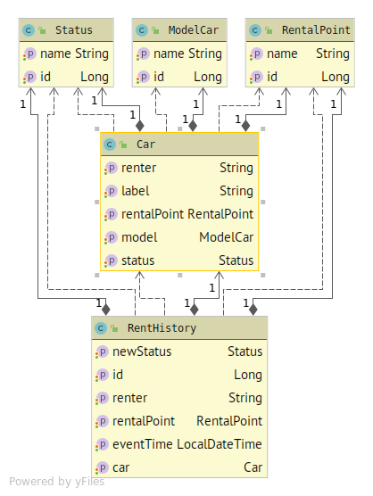

## Тестовое задание "Аренда автомобилей" (backend)

[Само задание](doc/task_description.pdf)

Сделано на Java, Spring Boot, Hibernate
#### Модель

- [Арендуемый автомобиль (Car)](src/main/java/ru/perm/v/rent/model/Car.java)
- [Марка автомобиля (ModelCar)](src/main/java/ru/perm/v/rent/model/ModelCar.java)
- [Пункт проката (RentalPoint)](src/main/java/ru/perm/v/rent/model/RentalPoint.java)
- [Текущий статус автомобиля (Status)](src/main/java/ru/perm/v/rent/model/Status.java)
- [Сведения об аренде (RentHistory)](src/main/java/ru/perm/v/rent/model/RentHistory.java)


#### Сервисы

Все сервисы реализуют CRUD интерфейс:
- GET-запрос __/api/{сервис}__ - получение всех сущностей сервиса
- GET-запрос __/api/{сервис}/{id}__ - получение конкретной сущности сервиса по идентификатору
- PUT-запрос __/api/{сервис}__ - создание конкретной сущности сервиса
- POST-запрос __/api/{сервис}__ - изменение конкретной сущности сервиса
- DELETE-запрос __/api/{сервис}/{id}__ - удаление конкретной сущности сервиса

Список сервисов: 
- [http://localhost:8080/api/car](http://localhost:8080/api/car) - сервис работы с машинами
    -  [http://localhost:8080/api/car/free](http://localhost:8080/api/car/free) - список свободных для аренды машин
    -  [http://localhost:8080/api/car/take](http://localhost:8080/api/car/take) - взять машину в аренду 
    -  [http://localhost:8080/api/car/return](http://localhost:8080/api/car/return) - сдать машину
- [http://localhost:8080/api/modelcar](http://localhost:8080/api/modelcar) - сервис работы с моделями машин 
- [http://localhost:8080/api/status](http://localhost:8080/api/status) - сервис работы со статусами машин ("Свободна","Арендована") 
- [http://localhost:8080/api/rentalpoint](http://localhost:8080/api/rentalpoint) - сервис работы с пунктами проката
- [http://localhost:8080/api/renthistory](http://localhost:8080/api/renthistory) - отчеты об аренде

#### Инструменты разработчика

- Реализован интерфейс Swagger по адресу [http://localhost:8080/api/swagger-ui.html](http://localhost:8080/api/swagger-ui.html) 
- Реализован доступ к СУБД через интерфейс  [http://localhost:8080/api/h2](http://localhost:8080/api/h2)

#### Запуск

````shell script
git clone https://github.com/cherepakhin/rent
cd rent
mvn spring-boot:run 
````

Сама база данных будет создана в памяти  при запуске. База данных [H2](https://www.h2database.com/html/main.html)
 
#### Демо

Демо проект развернут по адресу [http://v.perm.ru:8080/rent/....](http://v.perm.ru:8080/rent)
Т.е. /api заменить на /rent, ну и адрес не localhost :)

Пример для Swagger: [http://v.perm.ru:8080/rent/swagger-ui.html](http://v.perm.ru:8080/rent/swagger-ui.html)